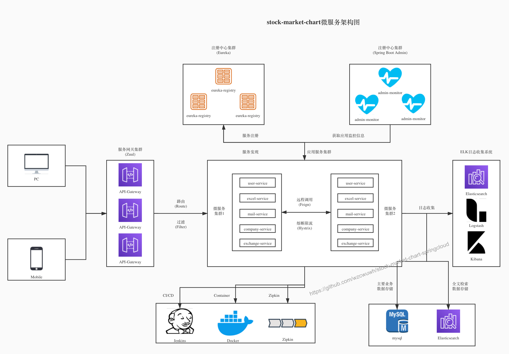

# stock-market-chart

Table of Contents
=================

   * [stock-market-chart](#stock-market-chart)
      * [Project Intro](#project-intro)
      * [System Archi](#system-archi)
      * [Organization Chart](#organization-chart)
      * [Tech Stack](#tech-stack)
         * [Backend Stack](#backend-stack)
         * [Front End](#front-end)
      * [Env Setup](#env-setup)
      * [License](#license)

## Project Intro
`stock-market-chart` is a full stack stock market system, using Spring Cloud Greenwich, Spring Boot 2, JPA, Mysql, Angular, to name just a few. It integrates registry center, config center, gateway, etc...

## System Architecture


## Organization Chart
``` lua
stock-market-chart
├── stock-market-chart-common
├── stock-market-chart-company
├── stock-market-chart-excel
├── stock-market-chart-mail
├── stock-market-chart-sector
├── stock-market-chart-security
├── stock-market-chart-user
├── stock-market-chart-exchange
├── stock-market-chart-es
```

## Tech Stack

### Backend Stack
| tech            | desc         | official site                             |
| ----------------| -------------| ------------------------------------------|
| Spring Cloud    | microservice | https://spring.io/projects/spring-cloud   |
| Spring Boot     | MVC framework| https://spring.io/projects/spring-boot    |
| Spring Security | authen/author| https://spring.io/projects/spring-security|
| JPA             | persistence  | https://spring.io/projects/spring-data-jpa|
| Swagger-UI      | document gen | https://github.com/swagger-api/swagger-ui |
| Docker          | container    | https://www.docker.com/                   |
| Mysql           | DB           | https://www.mysql.com/                    |
| JWT             | JWT token    | https://github.com/jwtk/jjwt              |
| Lombok          | encap tool   | https://github.com/rzwitserloot/lombok    |
| ElasticSearch   | text search  | https://www.elastic.co/                   |
| EasyPoi         | excel API    | http://easypoi.mydoc.io/                  |

### Front End
| tech            | desc         | official site                             |
| ----------------| -------------| ------------------------------------------|
| Angular 8       | front frame  | https://angularjs.org/                    |
| Angular Router  | router frame | https://angular.io/api/router/Router      |
| Bootstrap 4     | CSS toolkit  | https://getbootstrap.com/                 |
| Font Awesome    | font toolkit | http://fontawesome.dashgame.com/          |
| Axios           | http frame   | https://github.com/axios/axios            |
| Echarts         | chart toolkit| https://www.echartsjs.com/en/index.html   |

## Env Setup
tool    | version | download
--------| ------- | --------
JDK     | 1.8     | https://www.oracle.com/technetwork/java/javase/downloads/jdk8-downloads-2133151.html
Mysql   | 8.0     | https://www.mysql.com/
Angular | 8       | https://angularjs.org/ 
node    | 11.11.0 | https://nodejs.org/en/
npm     | 6.7.0   | https://www.npmjs.com/

## License
[Apache License 2.0]
Copyright (c) 2019-2020 wzcwuwh
